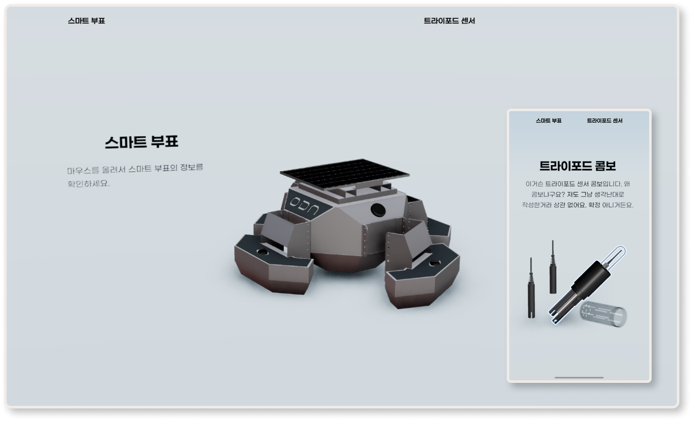

<div align='center'>



</div>

- [r3f GLTF Web Study](#r3f-gltf-web-study)
  - [1. 모델링 최적화 관련](#1-모델링-최적화-관련)
    - [1-1. gltf-pipeline](#1-1-gltf-pipeline)
    - [1-2. gltfjsx](#1-2-gltfjsx)
      - [1-2-1. gltfjsx Option](#1-2-1-gltfjsx-option)
    - [1-3. 모델링 수정 프로세스리](#1-3-모델링-수정-프로세스리)
  - [2. Dependencies](#2-dependencies)
    - [2-1. 사용한 라이브러리](#2-1-사용한-라이브러리)
    - [2-2. Troubleshooting](#2-2-troubleshooting)
    - [2-3. Docs](#2-3-docs)

# r3f GLTF Web Study

## 1. 모델링 최적화 관련

### 1-1. gltf-pipeline

```bash
npm i -g gltf-pipeline # 1. gltf-pipeline 설치

gltf-pipeline -i <modeling-original.glb> -d -o <modeling-draco.glb> --draco.quantizePositionBits 14 # 2. 최적화 진행 (용량 줄임)
```

- 기억하기 위한 메모 용도로, 자세한 사항은 추가 예정

### 1-2. gltfjsx

> [!TIP]
>
> [https://gltf.pmnd.rs/](https://gltf.pmnd.rs/) -> 웹에서 쉽게 사용 가능한 사이트

```bash
# 1. gltfjsx 설치
npm i -g gltfjsx

# 2. 모델링 컴포넌트화 진행
npx gltfjsx tripod-draco.glb --tranform --types
# --tranform : 컴포넌트 변환
# --types : TypeScript 타입 출력
```

#### 1-2-1. gltfjsx Option

```bash
Usage
  $ npx gltfjsx [Model.glb] [options]

Options
  --output, -o        Output file name/path
  --types, -t         Add Typescript definitions # 사용
  --keepnames, -k     Keep original names
  --keepgroups, -K    Keep (empty) groups, disable pruning
  --bones, -b         Lay out bones declaratively (default: false)
  --meta, -m          Include metadata (as userData)
  --shadows, s        Let meshes cast and receive shadows
  --printwidth, w     Prettier printWidth (default: 120)
  --precision, -p     Number of fractional digits (default: 3)
  --draco, -d         Draco binary path
  --root, -r          Sets directory from which .gltf file is served
  --instance, -i      Instance re-occuring geometry
  --instanceall, -I   Instance every geometry (for cheaper re-use)
  --exportdefault, -E Use default export
  --transform, -T     Transform the asset for the web (draco, prune, resize) # 사용
    --resolution, -R  Resolution for texture resizing (default: 1024)
    --keepmeshes, -j  Do not join compatible meshes
    --keepmaterials, -M Do not palette join materials
    --format, -f      Texture format (default: "webp")
    --simplify, -S    Mesh simplification (default: false)
      --ratio         Simplifier ratio (default: 0)
      --error         Simplifier error threshold (default: 0.0001)
  --console, -c       Log JSX to console, won't produce a file
  --debug, -D         Debug output
```

### 1-3. 모델링 수정 프로세스리

1. 기존 라이노 파일인 `.3dm` → `.fbx ` Export
   - Material 적용 X / Layer만 각 파트에 적용
2. Blender를 통해 `.fbx` 모델링 파일 Import
3. 기존에 Layer로 묶여있는 상태(parent의 children 상태)의 각 파트를 파트 별로 parent에서 분리
4. Join(단축키 J)하기 전에 각 Layer에 포함된 파트 별로 Material 작업 진행
   - 추후, Join 취소를 Material을 통해 진행할 수 있기 때문에 세부적으로 Material 지정이 중요
5. `.glb`로 Export

## 2. Dependencies

### 2-1. 사용한 라이브러리

> [!NOTE]
>
> 해당 기능 구현을 위한 필수 사항이 아닌 라이브러리는 `+` 표시

```diff
"@react-three/drei": "^9.117.3",
"@react-three/fiber": "^8.17.10",
"@react-three/postprocessing": "^2.16.3",
"@types/three": "^0.170.0",
+"@types/lodash": "^4.17.13",
"r3f-perf": "^7.2.3",
+"react-router-dom": "^6.28.0",
+"styled-components": "^6.1.13",
"three": "^0.170.0",
+"typescript": "^4.4.2",
```

### 2-2. Troubleshooting

drei 라이브러리에 내장된 배경 이미지(프리셋으로 설정된) 불러오기 에러로 인해 직접적인 파일 다운로드 및 적용

```bash
Could not load potsdamer_platz_1k.hdr: Failed to fetch
```

위의 에러의 경우 `useEnvironment()` 메서드의 프리셋인 `city` 사용에 의해 발생할 수 있는 에러로, 해당 Repo 외에도 전체적으로 drei 라이브러리를 사용하고 있는 Repo 전반에서 발생

> [!CAUTION]
>
> 기존의 배포된 사이트의 경우 모델링 페이지 로드 불가

해결 방안으로 개발자 도구의 네트워크 탭에서 불러오기를 시도하는 파일 명을 아래 사이트를 통해 리소스 다운로드 및 파일 경로를 통해 환경 이미지 설정 진행

> [!TIP]
>
> [Poly Haven → 3D Asset 관련 사이트](https://polyhaven.com/hdris)

```ts
const props = {
  env: {
    files: "/environment/potsdamer_platz_1k.hdr", // city (preset)
    // files: "/environment/lebombo_1k.hdr", // apartment (preset)
    // files: "/environment/forest_slope_1k.hdr", // forest (preset)
    // files: "/environment/studio_small_03_1k.hdr", // studio (preset)
    // files: "/environment/venice_sunset_1k.hdr", // sunset (preset)
    // files: "/environment/table_mountain_pure_sky_1k.hdr", // sea (edit)
  },
};

const env = useEnvironment({ preset: "city" }); // ⚠️ 간헐적인 에러 발생
const env = useEnvironment({ ...props.env }); // 에러 발생 X
```

### 2-3. Docs

- [pmnd.rs](https://docs.pmnd.rs/)
- [React Three Fiber.docs](https://r3f.docs.pmnd.rs/getting-started/examples)
